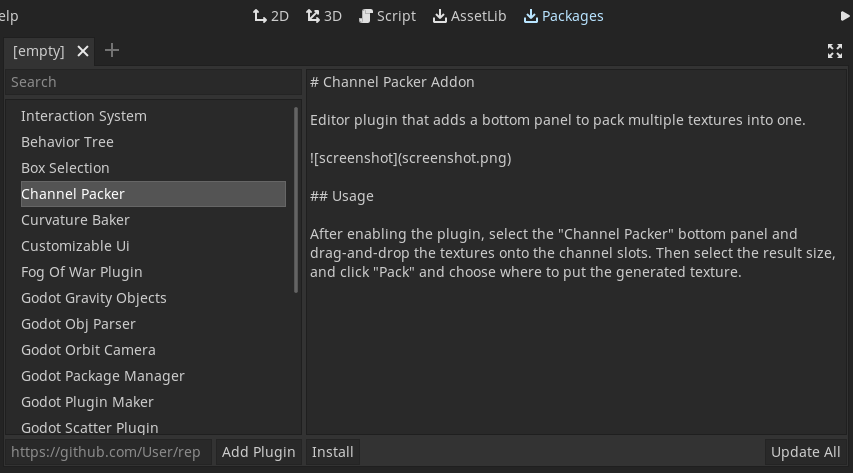

# Package Manager GUI

A in-editor GUI for my [package manager](git@github.com:Jummit/godot-package-manager.git) similar to the Asset Library.

## Usage

The addon stores existing addons and their metadata in a global list. To add addons to that list, enter any number of Github urls separated by spaces in the text box in the left bottom corner.

To install addons, select any number and click on "Install".
